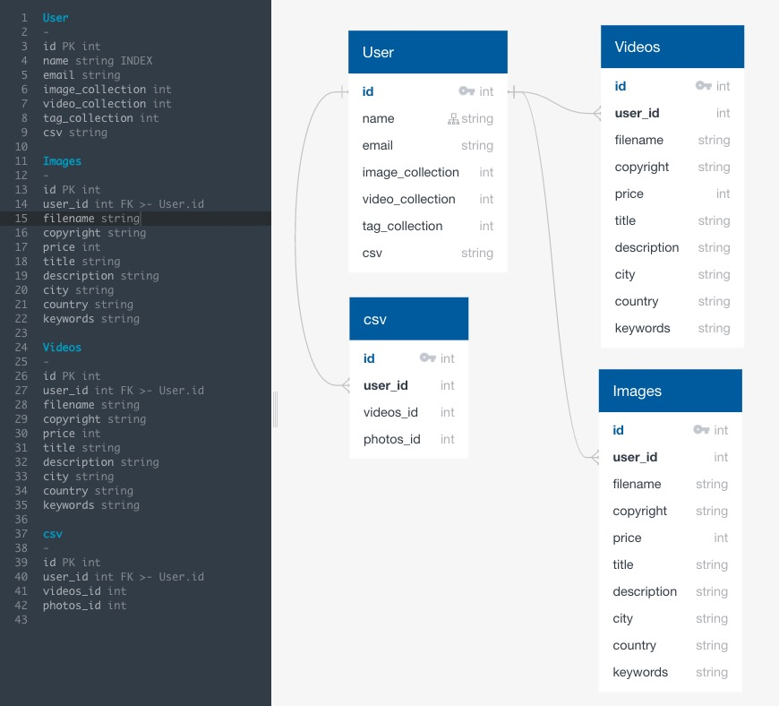

# Project Proposal

1. What goal will your website be designed to achieve?
* To help automate the tedious task for stock photographers and videographers.

2. What kind of users will visit your site? In other words, what is the demographic of your users?
* My target demographic would be photographers and videgraphers.

3. What data do you plan on using? You may have not picked your actual API yet,
which is fine, just outline what kind of data you would like it to contain.
* [Everypixel's API](https://labs.everypixel.com/api) generates keywords for images. I will use that data to create a csv file for the user. 

* [Pond 5 API](https://www.pond5.com/document/api.html) will be used for logging in user account.

4. In brief, outline your approach to creating your project (knowing that you may not know everything in advance and that these details might change later). Answer
questions like the ones below, but feel free to add more information:

a. What does your database schema look like?

b. What kinds of issues might you run into with your API?
* Have not yet found an API that creates keywords for videos
* Accuracy of keywords being generated
* Pond 5 API is not well documented, user may not be able to upload directly

c. Is there any sensitive information you need to secure?
* Besides my API keys, I'm thinking of having users being able to log in and create their own profiles to monitor their past stock footage.

d. What functionality will your app include?
* Automating users stock footage to CSV files and upload their footage to a platform of their choice.

e. What will the user flow look like?
* Upload footage
* Choose CSV format for stock platform
* Keywords are generated
* User can add/edit data
* When user submits data, CSV file will be generated
* Data will be automatically sent to platform

f. What features make your site more than CRUD? Do you have any stretch
goals?
* Automating keyword generators and exporting data to CSV files
* May need to use a FTP library to transfer files