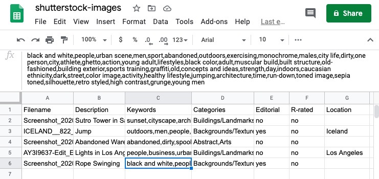

<h1 align="center">
Stock Footage Automator
</h1>
<p align="center">
Manage and sell your stock footage to various stock agencies with <a href="https://stock-footage-automator.herokuapp.com/" target="_blank">Stock Footage Automator</a>
</p>

## Upload files
<p align="center">

</p>

## Export to CSV
<p align="center">

</p>

## Supported Platforms
* [Shutterstock](https://submit.shutterstock.com/)
* [Pond5](https://contributor.pond5.com/) (Coming Soon)
* [Adobe Stock](https://contributor.stock.adobe.com/) (Coming Soon)

## Setup
### Clone directory:
```
$ cd [workspace folder]
$ git clone https://github.com/kevinreber/Capstone-Project.git
```

### Create Python virtual environment:
```
$ python -m venv venv
$ source venv/bin/activate
(venv) $ pip install -r requirements.txt
```

### Setup database and populate:
```
(venv) $ createdb automator
(venv) $ python seed.py
```

### Start server:
```
(venv) $ flask run
```
Open http://localhost:5000/ to view project in the browser.


## Testing
```
# Run all tests
(venv) $ python -m unittest

# Run individual tests
(venv) $ python -m unittest [test_file] 
```

## Built With
* [Axios](https://github.com/axios/axios)
* [Flask](https://flask.palletsprojects.com/en/1.1.x/)
* [WTForms](https://wtforms.readthedocs.io/en/2.3.x/)
* [Flask SQLAlchemy](https://flask-sqlalchemy.palletsprojects.com/en/2.x/)
* [PostgresSQL](https://www.postgresql.org/)

## Styled With
* [Twitter Bootstrap](https://getbootstrap.com/)
* [SASS](https://sass-lang.com/install)

## Image Host
* [Imagekit.io](https://imagekit.io/)

## Keyword Generating API
* [Everypixel](https://labs.everypixel.com/api)

## Authors
* Kevin Reber - [Github](https://github.com/kevinreber) - [Website](https://www.kevinreber.dev/) - [LinkedIn](https://www.linkedin.com/in/kevin-reber-6a663860/)

## Hosted on 
[Heroku](https://www.heroku.com/)
